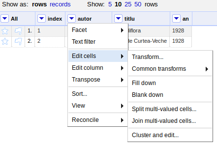
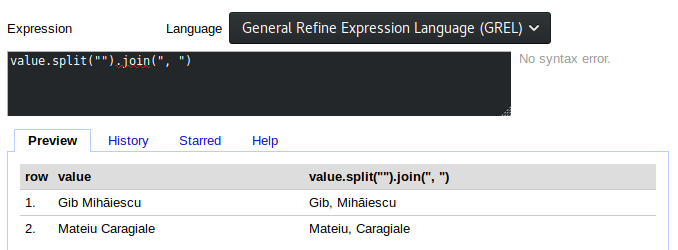

# Expresii

General Refine Expression Language este limbajul prin care comunici intențiile de modelare a datelor pachetului OpenRefine. GREL este proiectat să semene cu JavaScript. Majoritatea funcțiilor interne din JavaScript vor funcționa fără probleme în GREL. Unele sintaxe seamănă mai degrabă cu Python.

În GREL (General Refine Expression Language), expresiile sunt folosite pentru a transforma și pentru a crea date pe baza celor existente.

O expresie va fi aplicată tuturor rândurilor din set pentru o anumită valoare poziționată pe o anumită coloană.

## Valorile

Valorile sunt conținutul celulelor intr-un rând. Aceste valori pot fi accesate repetitiv fiecare dintre ele pentru întreg setul de date. Acest lucru se va face creându-se o expresie de prelucrare pentru valoare. Valoare (`value`) este ca un identificator pentru o variabilă, care se va modifica pe măsură ce se va parcurge întreg setul de date analizându-se rând după rând.

Să presupunem că avem următorul set:

|index|autor|titlu|an|
|:-|:-|:-|:-|
|1|Gib Mihăiescu|Grandiflora|1928|
|2|Mateiu Caragiale|Craii de Curtea-Veche|1928|

Acest set a fost constituit anterior. Poți să-l reconstuiești simplu deschizând LibreOffice Calc, introduci datele și salvezi ca CSV. Apoi deschizi OpenRefine și faci un proiect încărcând setul.

În OpenRefine arată astfel, după ce ai creat proiectul.

Folosind Transform (Edit->Transform) putem modela conținutul celulelor de pe o coloană folosindu-ne de o expresie, care în cazul nostru aplică două funcții consecutive: `split`, care tratează valoarea unei celule ca pe un șir de caractere care poate fi modelat după unele dintre ele așa cum este spațiul și apoi `join`, care recompune textul folosing un caracter menționat.

Trebuie să completez aici cu câteva informații importante. Un șir de caractere asupra căruia i se aplică o funcție `split` va fi „spart” după caracterul sau secvența de caractere menționată ca argument al funcției split într-un array (valori indexate într-o structură de date container care se numește array și care le ține precum un șirag de mărgele). Dacă în cazul `Gib Mihăiescu` aveam șirul unitar, ca valoare șir în sine, imediat după aplicarea funcției split(" "), care menționează spațiul ca fiind caracterul după care se va face fragmentarea, va rezulta o structură de date indexată (array): `["Gib", "Mihăiescu"]`.

Te vei întreba care este avantajul? Acesta este că folosindu-te de array, ai acces la fiecare cuvânt în parte din șir apelându-l după indexul alocat automat începând cu 0. Cool, nu?

Am lămurit care-i treaba cu array-ul. Trebuie să completez că `join(", ")` este o funcție care face operațiunea inversă. Adică preia un array și unește într-un șir de caractere toate valorile din array, pe care le aranjează într-o succesiune delimitată de un caracter menționat ca argument al funcției între ghilimele.

Hai să facem uz de avantajele pe care le expune lucrul cu un array și să extragem doar un fragment din șirul de caractere pe care-l avem ca valoare într-o celulă: `value.split(" ")[0]`.

Rezultatul este că obținem doar un singur cuvânt reducând astfel un șir întreg doar la un singur fragment util.

## Cunoștințe de bază

Am menționat faptul că OpenRefine folosește o sintaxă care seamănă cu cea a JavaScript-ului. Cei care cunosc JavaScript și ceva Python, nu vor avea probleme să înțeleagă expresiile folosite pentru a modela datele. Pentru cei care nu cunosc programare, nu aveți a vă teme de nimic. Voi încerca să explic noțiunile cu care lucrăm și tot ceea ce vom face va fi bogat ilustrat pentru a compensa în mod util.

Pentru avea cel mai bun start, vom arunca o privire căre valorile pe care le vom manipula.

## Resurse

### Video
https://www.youtube.com/watch?v=wGVtycv3SS0
