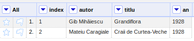

# Expresii

În GREL (General Refine Expression Language), expresiile sunt folosite pentru a transforma și pentru a crea date pe baza celor existente.

O expresie va fi aplicată tuturor rândurilor din set pentru o anumită valoare poziționată pe o anumită coloană.

## Valorile

Valorile sunt conținutul celulelor intr-un rând. Aceste valori pot fi accesate repetitiv fiecare dintre ele pentru întreg setul de date. Acest lucru se va face creându-se o expresie de prelucrare pentru valoare. Valoare (`value`) este ca un identificator pentru o variabilă, care se va modifica pe măsură ce se va parcurge întreg setul de date analizându-se rând după rând.

Să presupunem că avem următorul set:

|index|autor|titlu|an|
|:-|:-|:-|:-|
|1|Gib Mihăiescu|Grandiflora|1928|
|2|Mateiu Caragiale|Craii de Curtea-Veche|1928|

În OpenRefine arată astfel, după ce ai creat proiectul.

Folosind Transform (Edit->Transform) putem modela conținutul celulelor de pe o coloană folosindu-ne de o expresie, care în cazul nostru aplică două funcții consecutive: `split`, care tratează valoarea unei celule ca pe un șir de caractere care poate fi modelat după unele dintre ele așa cum este spațiul și apoi `join`, care recompune textul folosing un caracter menționat.

Trebuie să completez aici cu câteva informații importante. Un șir de caractere asupra căruia i se aplică o funcție `split` va fi spart după caracterul sau secvența de caractere menționată ca argument al funcției split într-un array (valori indexate într-o structură de date container care se numește array și care le ține precum un șirag de mărgele). Dacă în cazul `Gib Mihăiescu` aveam șirul unitar, ca valoare șir în sine, imediat după aplicarea funcției split(" "), care menționează spațiul ca fiind caracterul după care se va face fragmentarea, va rezulta o structură de date indexată (array): `["Gib", "Mihăiescu"]`.
Te vei întreba care este avantajul? Acesta este că folosindu-te de array, ai acces la fiecare cuvânt în parte din șir apelându-l după indexul alocat automat începând cu 0. Cool, nu?
