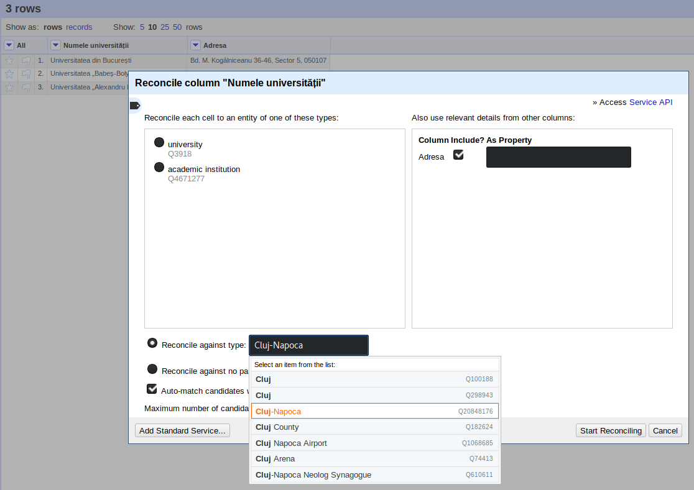
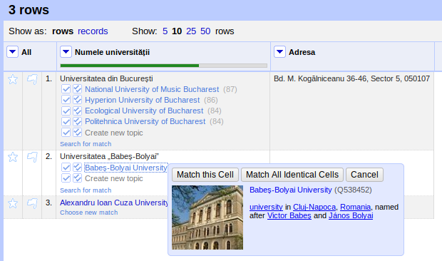

# Reconcilierea

Reconcilierea este un proces care constă din punerea cap la cap a unor setări care să facă legături la baze de date externe. De ce facem aceste legături? Pentru că datele cuprinse în acestea ne-ar putea ajuta în procesul de dezambiguizare a unor date cu care lucrăm noi. Este până la urmă a determina care Horia Hulubei din cei 2 pe care-i avem în datele noastre este renumitul fizician. Legăturile se fac între fragmentul de text dintr-o celulă și un identificator identic dintr-o bază de date, dacă ar fi să ne explicăm simplist cum stă treaba.
În mare parte ajută să gândim că folosim vocabulare externe pe care dorim să le utilizăm pentru a elimina starea de ambiguitate asupra a cine sau ce este valoarea din celulă care reprezintă o anumită realitate, un fapt, etc.

Completarea care lămurește condițiile în care se poate face reconciliere cu alte baze de date, este aceea că respectivele baze de date trebuie să respecte „Reconciliation Service API”. Wikidata este o astfel de bază de date.

Reconcilierea poate fi inițiată din pagina de web care constituie interfața grafică. Apăsând pe săgeata din dreptul numelui coloanei, alegi „Reconcile” și apoi „Start reconciling”.

Să experimentăm. Am constituit repede un miniset de date din trei universități din România.

```text
Numele universității,Adresa
Universitatea din București,"Bd. M. Kogălniceanu 36-46, Sector 5, 050107"
Universitatea „Babeș-Bolyai”, "Universitatii 7-9, Cluj-Napoca 400084"
Universitatea „Alexandru Ioan Cuza” din Iași,"Bulevardul Carol I, Nr.11, 700506"
```

Pe coloana „Numele universității” vom acționa următorii pași: Reconcile - Start reconciling...

Vom avea acces în acest moment la serviciul de reconsiliere pus la dispoziție de Wikidata pe care-l și alegem, de fapt. Vom vedea în panoul care tocmai s-a deschis că entitățile alăturate automat de valorile de pe coloana numelui universității, sunt codate conform unei schme de identificatori proprii Wikidata.

În cazul nostru, serviciul de reconciliere a tras concluzia că despre universități este vorba pentru coloana în cauză și din vocabularul Wikidata și a făcut o legătură la entitățile de tip „university” având identificator Q3918 („Reconcile each cell to an entity of one of these types:”). Aceasta este oferta automată a serviciului, dar se poate interveni atunci când se dorește să se facă reconcilierea după o altă entitate a Wikidata. În acest sens, vei opta pentru „reconcile against type” de mai jos iar în câmpul alăturat, vei introduce numele entității pentru care dorești ca serviciul să facă potriviri în baza de date.



Ceea ce este vizibil și util totodată este introducere în procedura de reconciliere o altă coloană care oferă încă un indiciu important. Pentru că în cazul nostru avem doar o singură coloană suplimentară, aceasta va fi oferită drept opțiune.

Rezultatul unei reconcilieri simple indică faptul că rezultatele oferite drept alternativă, reprezintă varianta în limba engleză.


