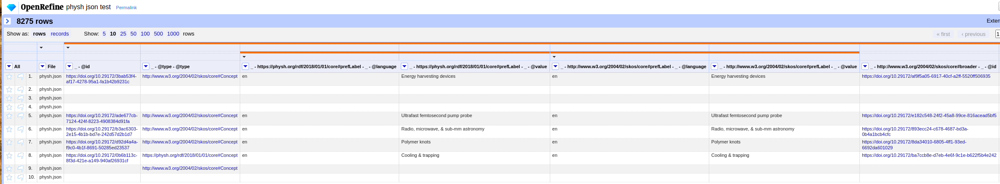

# Introducere

OpenRefine este un software cu sursă deschisă, care are la origini o creație Google numită GoogleRefine.

OpenRefine este scris în Java și rulează fără a fi online. Chiar dacă OpenRefine rulează un server la momentul executării servind o pagină de web, datele prelucrate și acest server nu comunică pe Internet. Datele sunt doar pe computerul local. Acest lucru permite prelucrarea propriilor date în deplină siguranță.

## Structura datelor

Materialul de lucru de zi cu zi sunt datele agregate în formate tabelare care dispun valori la intersecția unei coloane cu un rând. Seamănă foarte mult modelul de așezare cu un grafic cartezian pentru care aveam o intersecție a lui x cu y într-un punct.

||coloană|
|:-|:-|
|rând|valoare|

Cel mai simplu mod de a reprezenta date este într-o structură tabelară folosind apoi un format de reprezentare a dispunerii datelor care utilizează caractere ce delimitează seriile de date. De exemplu, unul dintre cele mai utilizate formate în acest moment este Comma Separated Values, pe scurt CSV. Mai pe românește, un CSV este un mod de a pune date într-un fișier text în care fiecare rând este un rând de date având valorile celulelor delimitate prin caracterul virgulă.

```text
numeCol1,numeCol2
10, 20
ceva, altceva
```

Alte fișiere pe care le poate importa OpenRefine sunt menționate chiar la deschiderea paginii de interacțiune. În mare sunt toate cele care oferă o schemă de agregare a datelor după un anumit standard: TSV, CSV, *SV, Excel (.xls and .xlsx), JSON, XML, RDF și XML.

OpenRefine a fost extins și în domeniul Web-ului Semantic, fiind capabil să gestioneze triple RDF prin extensiile sau versiunile derivate ale software-ului.

## Linii și înregistrări

OpenRefine oferă posibilitatea de a importa datele unei înregistrări indiferent de formatul importului. În acest moment, se pot importa date în diferite formate - TSV, CSV, *SV, Excel (.xls and .xlsx), JSON, XML, RDF as XML, și documente Google Data.


Pentru a face un mic test, să importăm datele unui tezaur specializat: PhySH - https://physh.org/.


Vom face importul datelor în format JSON din fișierul care poate fi găsit în distribuția 2.4.0 a resurselor tezaurului disponibile de la https://github.com/physh-org/PhySH/. Vom folosi fișierul `physh.json`. Apeși butonul `Choose Files`, seletezi fișierul din directorul de pe hard disk și apoi apare un panou de privizualizare a structurii de date din fișier pentru care vei fi invitat să alege care este o înregistrare completă.


Zona înregistrării va fi delimitată printr-un chenar punctat cu roșu, iar interiorul va fi colorat. Odată dat un simplu click pe această selecție, se actualizează panoul de previzualizare cu o structură tabelară. Fii foarte atent că poți selecta și părți ale unei înregistrări, dar acestea trebuie să existe în toate înregistrările. Acest lucru îl poți face pentru a limita cantitatea de date cu care vei lucra.


Reține detaliu că te afli încă în stadiul de creare a unui proiect de lucru. Martor stă butonul `Start over` care îți va permite să refaci pașii dacă ai făcut o selecție greșită, fie de fișier, fie de înregistrare.

În acest moment, în colțul dreapta sus ai posibilitatea de a introduce numele proiectului, precum și câteva etichete utile pentru a da cât mai multe detalii despre ceea ce dorești să faci.


În partea inferioară a panoului de lucru din pagina previzualizării sunt câteva opțiuni legate de preluarea datelor. Câteva dintre acestea sunt foarte utile în curățarea inițială. Am ales să fac trimming și să păstrez fișierul sursă în proiectul meu.


Tot ce mai rămâne în acest moment este să apeși pe `Create project`.

În acest moment, proiectul este gata de lucru. Haide să privim la ceea ce a fost creat.



Dacă te vei uita cu atenție la structura înregistrării așa cum este ea în fișierul original, vei observa că părțile *în adâncime* sunt marcate printr-o dungă de culoarea coralului.

Din acest moment poți începe prelucrarea datelor importate. Reține faptul că poți oricând să te oprești din lucru când ai terminat sau faci o pauză prin închiderea ferestrei browserului. Poți deschide mai târziu prin pornirea aplicației și deschiderea unei ferestre de browsing. Dacă dorești să deschizi alt proiect, ai la îndemână butonul `Open` care îți permite alegerea celui cu care vrei să lucrezi.


Vei întreba pe bună dreptate dacă poți deschide mai multe proiecte în paralel. Desigur. OpenRefine este un server local care poate oferi acces la mai multe proiecte deodată. Tot ce trebuie să cunoști este un link care se ascunde sub `Permalink`. Acest `Permalink` este unic pentru fiecare proiect.

Toate proiectele *țin minte* toate operațiunile pe care le aplici. Acestea sunt contabilizate în coloana din stânga, în tabul numit `Undo/Redo`. Mai jos este o variantă de lucru a fișierului original la care am ajuns prin ștergerea unor coloane și redenumirea celor rămase.


Acest istoric al operațiunilor este foarte important pentru că îți permite să revii la stări anterioare. O simplă apăsare pe butonul `Extract` vă va deschide un panou din care poți salva istoricul.


Din acest panou, poți alege care operațiuni dorești să le salvezi și acestea vor fi trecute într-un fișier în format JSON pe care îl poți salva. La ce este acest lucru util. Ai intuit corect. Pentru a transforma un set de operațiuni într-o adevărată rețetă pe care să o aplici ori de câte ori dorești în alte proiecte sau pe date similare. Să presupunem că aș salva doar primele trei opțiuni, conținutul fișierului meu ar avea o structură similară cu cea de mai jos.


## Diferența dintre linii și înregistrări

O privire atentă peste panoul de lucru indică un lucru interesant. Există o diferență care trebuie făcută de la bun început între liniile (`rows`) care apar și înregistrări (`records`). Ba chiar interfața îți permite să basculezi între o perspectivă a tabelului afișată având liniile în prim plan sau alternativa, întregistrările.

Records:


Rows:


Observă faptul că în cazul afișării la nivel de înregistrare, numerotarea se face în consecință spre deosebire de rânduri, unde numerotarea se face pe fiecare linie în parte.

## Resurse

- [Exploring data](https://openrefine.org/docs/manual/exploring#rows-vs-records)